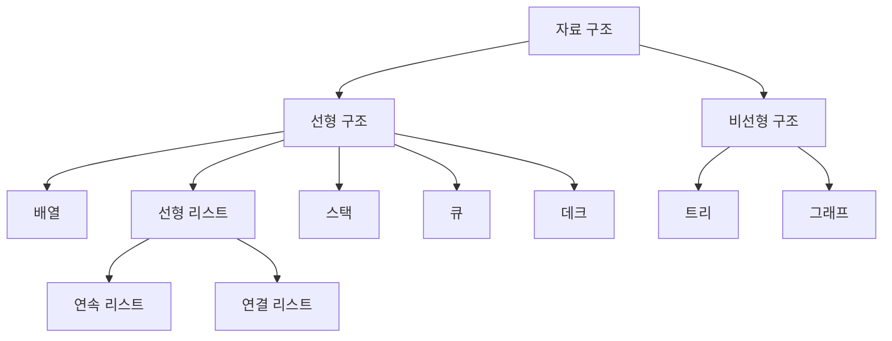
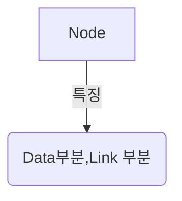
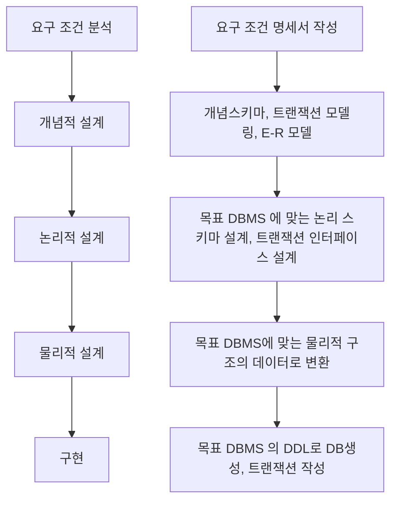

## 074 자료구조
효율적인 프로그램 : 저장공간의 효율성과 실행시간의 신속성

선형 리스트 : 배열을 이용한다 => 연속 리스트, 포인터를 이용한다 연결 리스트

- 연속리스트 : 밀도1(효율 제일 좋음), 연속되는 장소 저장
- 연속 리스트(Linked List) : 삽입 삭제 용이. 연속적이지 않아도 저장가능, 효율 별로, 속도 느림, 중간노드 끊어지면 찾기 힘듬

노드(Node)

포인터(Pointer) : 현재 위치에서 다음 노드의 위치를 알려주는 요소.

- 프런트 포인터(Front, Pointer) : 리스트를 구성하는 최초의 노드 위치를 가르키는 요소
- 널 포인터 (Null Pointer, Nill Pointer) : 다음 노드가 없음을 나타내는 포인터. 0, 밑변이없는 삼각형, \0 등의 기호를 입력하여 표시

스택 : 후입선출(LIFO)
- 기억공간 풀상태에서 삽입 : 오버플로
- 삭제할 데이터가 없는 상태에서 데이터를 삭제 : 언더 플로

- TOP : 가장 마지막으로 삽입된 자료가 기억된 위치 
- Bottom : 스택의 가장 밑바닥

스택에서는 포인터가 0을 가지고 있다면 삭제할 자료가 없기 때문에 UnderFlow 를 발생시킨다.

큐(Queue) 
- 한쪽에는 삽입만 다른 한쪽에는 삭제 작업만 가능한 자료 구조.
- 선입선출(FIFO) 방식.
- 시작과 끝을 표시하는 2개의 포인터가 존재.
    - 프런트(F) 포인터 : 가장 먼저 삽입된 자료의 기억 공간을 가르키는 포인터.
    - 리어(R, rear) 포인터 : 가장 마지막에 삽입된 자료가 위치한 기억 공간을 가르키는 포인터.

사용처
- 운영체제 작업 스케줄링.

데크(Deque)
- 삽입과 삭제가 양쪽에서 발생하는 자료구조.
- Double Ended Queue
- 스택과 큐의 장점만 구성한 자료구조임.
- 입력제한, 출력 제한이 있다.
--> 제한이 걸리면 한쪽만 입력/출력이 가능해진다.

- 출력 제한 데크 : Shelf

그래프(G)
- 정점(V, Vertex)와 간선 (E,Edge)의 두 집합으로 이루어짐.
- 간선의 방향성 유무에 따라 `방향 그래프`와 `무방향 그래프` 로 이루어짐.

- 사용
통신망, 교통망, 이항 관계 등에 사용.\

- 트리(Tree)는 사이클이 없는 그래프(Graph).

- 무방향 그래프 간선 수 : n(n-1)/2
- 방향 그래프 간선 수 : n(n-1)

## 75 트리
트리 : 정점(Node)과 선분(Branch)을 이용하여 사이클을 이루지 않도록 구성한 그래프의 형태.

- 노드 : 기억공간
- 링크 : 노드와 노드를 연결하는 선

- 근 노드(Root Node) : 트리 맨위 노드
- 디그리(Degree, 치수) : 각 노드에서 뻗어 나온 가지 수
- 단말 노드(Terminal Node) = 잎 노드(Leaf Node) :  자식이 없는 노드. 디그리 0
그외에도 자식, 형제, 부모 노드가 있다.
- 트리의 디그리 : 노드의 디그리 중에서 가장 많은 수

트리의 운행법 : Traversal
- Preorder 운행 : Root - Leaf - Right 순
- Inorder 운행 : Leaf - Root - Right 순
- Postorder 운행 : Leaf - Right - Root 순

수식 표기법

이진트리를 많이 사용함.

전위 표기법(PreFix) : 프리오더
중위 표기법(InFIx) : 인오더
후위 표기법(PostFIx)  : 포스트오더

표기 변환 
"""

## 076 정렬 (Sort) - pass
- n번째 키를 n-1 번개의 키와 비교하여 알맞은 순서를 삽입하여 정렬하는 방식.
- 평균과 최악 모두 수행 시간 복잡도는 o(n2)이다.

## 077 검색 - 이분 검색 / 해싱 - pass 

## 078 데이터베이스 개요
데이터저장소 : 데이터를 논리적인 구조로 조직화, 물리적 공간에 구축한 것을 말함

- 데이터 저장소는 물리적 , 논리적 데이터 저장소로 나뉜다.

DB 정의 
- 통합된 데이터(Integrated Data) : 자료의 중복을 배제한 데이터 모임
- 저장된 데이터 (Stored Data) : 컴퓨터가 접근할 수 있는 저장 매체에 저장된 자료.
- 운영 데이터(Operational Data) : 조직의 고유한 업무를 수행하는데 존재 가치가 확실하고 없어서는 안 될 반드시 필요한 자료.
- 공용 뎅치터(Shared Data) : 여러 응용 시스템들이 공동으로 소유하고 유지하는 자료.

데이터베이스의 특징
- 실시간 접근성(Real-time Accessibility) : 비정형적인 질의에 실시간 처리가능.
- 계속적인 변화(Continuous Evolution) : DB는동적. RUD로 항상최신 데이터 유지.
- 동시 공용(Concurrent Sharing) : 여러 사용자가 같은 내용의 데이터 이용가능 
- 내용에 의한 참조(Content Reference) : 사용자 요구 데이터 내용으로 데이터를 찾는다.

**DBMS**
정의 : 사용자와 DB 사이에서 사용자 요구에 따라 정보를 생성, DB를 관리해주는 소프트웨어.

- 데이터 종송성, 중복성을 해결하기 위해 나옴.

DBMS 필수 기능
- 정의(Definition) : 데이터 타입과 구조 정의, 이용방식, 제약 조건 명시
- 조작(Manipulationon) : 검색, 갱신, 삭제 처리를 위한 수단 제공
- 제어(Control) : 갱신, 삭제, 삭제 작업이 수행되도록 무결성 유지되도록 제어. 보안과 권한 검사. 병행 제어
    - > 제어 핵심 : 무결성, 권한 검사, 병행 제어

DBMS 장단점
장점
- 논리적, 물리적 독립성 보장
- 중복 피해서 공간 절약
- 자료 공동 이용
- 일관성, 무결성, 보안 유지
- 데이터 표준화 가능
- 데이터 통합 관리
- 최신 데이터 유지
- 실시간 처리

단점
- 전문가 부족
- 전산화 비용 증가
- 과부하 발생
- 파일의 예비(Backup)과 회복(Recovery)이 어려움
- 시스템이 복잡하다.

**스키마** 
- 명세(Specification)를 기술한 메타데이터의 집합
- DB를 데이터 객체(Entity), 속성(Attribute), 관계(RelationShip) 및 제약 조건 등에 관해 정의 한다.
- 외부 스키마, 개념 스키마, 내부 스키마로 나뉜다.

외부 스키마 : DB를 논리적 구조 정의

개념 스키마 : 그냥 스키마라고 하면 디폴트가 이거다. 하나만 존재. 제약조건 접근권한, 보안 및 무결성 규칙 정의

내부 스키마 : 물리적 저장장치 입장에서 본 DB 구조. 저장 스키마(Storage Schema)라고도함.

## 079 데이터베이스 설계

**데이터베이스 설계 시 고려사항**
- 무결성 : RUD 후에도 제약조건을 항상 만족해야한다.
- 일관성 
- 회복 : 장애 발생시 직전 상태로 복구 할 수 있어야 한다.
- 보안 : 손실로 부터 보호
- 효율성 : 응답시간, 생산성, 저장공간 최적화
- 데이터베이스 확장 : 운영에 영향을 주지 않으면서 지속적으로 데이터 추가가 가능해야 한다.

**데이터베이스 설계 순서**

**요구 조건 분석**
- DB 사용자에 따른 데이터의 종류, 용도, 처리형태, 흐름, 제약 조건 수집
- 수집된 정보를 바탕으로 명세서 작성

**개념적 설계**
- 현실세계 무한성과 계속성을 추상적 개념으로 표현하는 과정
- 개념스키마 모델링과 트랜잭션 모델링을 병행 수행.
- 요구 조건 명세를  `E-R 다이어그램` 으로 작성.
- 독립적인 개념스키마를 설계

**논리적 설계(데이터 모델링)**
- 현실세계에서 발생하는 자료를 컴퓨터가 이해하고 저장장치에 저장할 수 있도록 변환하기 위해 변환(mapping) 하는 과정
- RDBMS라면 테이블을 설계하는 단계이다.
- 논리적 스키마를 설계하는 단계
- 트랜잭션의 인터페이스를 설계

**물리적 설계(데이터 구조화)**
- 논리적 설계에서 물리적 구조의 데이터로 변환하는 과정.
- DB 파일의 저장구조 및 액세스 경로를 결정
- 물리적 데이터베이스 구조는 DB 시스템의 성능에 중대한 영향을 미친다.
- 단순한 파일과 다르다.
- 데이터 단위는 저장 레코드(Stored Record)이다.

**물리적 설계 단게에서 포함되어야 하는것**
- 저장 레코드 양식 설계
- 레코드 집중(Record Clustering)의 분석 및 설계
- 접근 경로 설계 등

**물리적 설계 시 고려사항**
- 인덱스 구조
- 레코드 크기
- 파일에 존재하는 레코드 개수
- 트랜젝션의 갱신과 참조 성향
- 성능 향상을 위한 개념 스키마 번경 여부 검토
- 트랜잭션 수행 속도를 높이기 위한 고려
- 파일 크기의 변화 가능성 고려

**물리적 설계 옵션 선택 시 고려 사항**
- 반응 시간 : 트랜잭션 수행 시첨부터 처리 결과 까지 경과 시간
- 공간 활용도 : 저장공간의 양
- 트랜잭션 처리량 : 단위 시간동안 DB시스테멩 처리될 수 있는 트랜잭션의 평균 개수

**데이터베이스의 구현**
- 스키마를 파일로 생성하는 과정
    - DDL을 이용하여 빈 데이터 베이스를 생성
    - 데이터를 입력
    - 트랜잭션 작성
    - DB 접근을 위한 응용 프로그램을 작성

## 080 데이터 모델의 개념

**정의**
- 현실 세계 정보들을 단순화, 추상화하여 컴퓨터에 표현한 개념적 모형

**종류**
- 개념적 데이터 모델, 논리적 데이터 모델, 물리적 데이터 모델

**표시 요소**
- 구조, 연산, 제약 조건

**구성 요소**
- 개체, 속성, 관계

**개념적 데이터 모델**
- 인간의 이해를 돕기 위해 추상적 개념으로 표현하는 과정. 정보 모델이라고도 함
- e.g ) `E-R모델`

**논리적 데이터 모델**
- 위에서 얻은 개념적 구조를 컴퓨터가 이해,처리 할 수있는 컴퓨터 환경에 맞도록 변환하는 과정
- 단순히 데이터 모델이라고만 하면 `논리적 데이터 모델`이다.

**데이터 모델에 표시할 요소**
- 구조
- 연산
- 제약 조건

**데이터 모델의 구성 요소**
- 개체(Entity)
    - 정보 단위 같은 현실 세계의 대상체
    - 파일 시스템의 레코드에 대응하는 것으로 정보를 제공하는 역할을 수행.
    - 독립적으로 존재 or 그 자체로도 구별 가능.

- 관계(Relationship)
    - 개체 간의 관계 또는 속성 간의 관계.
    - *형태*
        - 1대1, 1대 다, 다 대 다

## 081 ER(개체-관계) 모델
- 피터 첸에 의해 제안됨.
- 현실 세계의 무질서한 데이터를 개념적인 논리 데이터로 표현하기 위한 방법.
- E-R 모델에선 개체, 관계, 속성을 묘사함. 그 후 일반화 계층 개념이 추가됨
- E-R 모델은 DBMS를 고려한 것은 아니다.

E-R 다이어그램

## 082 관계형 데이터 모델

**관계형 데이터 모델(Relational Data Model)**

2차원적인 표(Table)를 이용해 데이터 상호 관계를 정의하는 DB구조를 말함.

관계 모델에서 테이블을 릴레이션(Relation)이라고도 부른다.  
개체와 와 개체 간의 관계를 Relationship라고 하는데 그거랑 다르다.

## 083 관계형 데이터베이스의 구조
`05-13`

개요
- IBM 직원 코드(E.  F. Codd)에 의해 제안됨.
- 개체(Entity)나 관계(Relationship)를 모두 릴레이션(Relation)이란는 표(Table)로 표현한다.
- 릴레이션은 개체를 표현하는 `개체 릴레이션`, 관계를 나타내는 `관계 릴레이션` 으로 구분.

- 장점 : 간결, 다른 데이터 베이스로 변환 용이
- 단점 : 성능이 다소 떨어짐

관계형 DB의 Relation 구조

튜플(Turple)
- 릴레이션을 구성하는 각각의 행을 말함.
- 속성의 모임으로 구성
- 레코드와 같은 의미
- 튜플의 수를 `카디널리티(Cardinality)` 또는 `기수`, 대응수라고 함

속성(Attribute)
- 데이터베이스를 구성하는 가장 작은 논리적 단위.
- 데이터 항목 또는 데이터 필드에 해당된다.
- 개체의 특성을 기술한다.
- 속성의 수를 `디그리(Degree)`또는 `차수` 라고 한다

도메인(Domain)
- 하나의 애트리뷰트(Attribute)가 취할 수 있는 같은 타입의 원자(Atomic)값들의 집합이다.
- 도메인은 애트리뷰트 값이 나나탈때 시스템이 합법여부를 검사하는데 이용된다. 
    e.g) 학생 릴레이션에서 '학년'의 도메인은 1 ~ 4이다.

릴레이션의 특징
- 한 릴레이션에는 똑같은 튜플이 포함될 수 없다.
- 튜플 사이에는 순서가 없다.
- 속성들의 부분집합을 키(key)로 설정한다. <-- 키는 유일한 식별자다. 

## 084 관계형 데이터베이스의 제약 조건 - 키(Key)
`05-14`

**제약조건** :  
데이터베이스에 저장되는 데이터의 정확성을 보장하기 위해 키(Key)를 이용해 입력 데이터에 제한을 주는 것을 말함. 
e.g) 무결성 제약, 참조 무결성 제약 등

키(Key) : 후보키, 기본키, 대체키, 슈퍼키, 외래키 등이 있다.

**후보키(Candidate Key)**

- 튜플을 유일하게 식별하기 위해 사용하는 속성들의 부분 집합.
- 기본키로 사용할 수 있는 속성들을 말함
- 모든 릴레이션에는 하나 이상의 후보키가 존재한다.
    - 유실성, 최소성을 만족해야 한다.

**기본키(Primary Key)**

- 후보키 중에 선정된 주키(Main Key)로 중복 불가능.
- 유일하게 구별할 수 있는 속성임.
- 기본키는 후보키의 성질을 가짐.(유일성, 최소성을 가짐)
- null 불가능.

**대체키(Alternate Key)**

- 후보키가 둘 이상일 때 기본키를 제외한 나머지 후보키를 의미함.

**슈퍼키(Super Key)**
릴레이션 내의 속성들의 집합으로 구성된 키

**외래키(Foreign Key)**
다른 릴레이션의 기본키를 참조하는 속성 또는 속성들의 집합

Q : 유일성O, 최소성X : 슈퍼키

## 085 관계형 데이터베이스의 제약 조건 - 무결성
