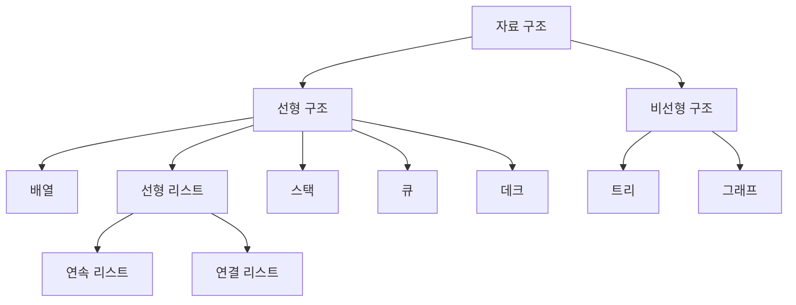
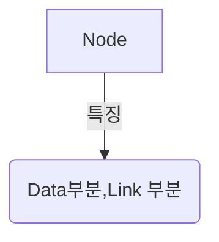

## 074 자료구조
효율적인 프로그램 : 저장공간의 효율성과 실행시간의 신속성

선형 리스트 : 배열을 이용한다 => 연속 리스트, 포인터를 이용한다 연결 리스트

- 연속리스트 : 밀도1(효율 제일 좋음), 연속되는 장소 저장
- 연속 리스트(Linked List) : 삽입 삭제 용이. 연속적이지 않아도 저장가능, 효율 별로, 속도 느림, 중간노드 끊어지면 찾기 힘듬

노드(Node)

포인터(Pointer) : 현재 위치에서 다음 노드의 위치를 알려주는 요소.

- 프런트 포인터(Front, Pointer) : 리스트를 구성하는 최초의 노드 위치를 가르키는 요소
- 널 포인터 (Null Pointer, Nill Pointer) : 다음 노드가 없음을 나타내는 포인터. 0, 밑변이없는 삼각형, \0 등의 기호를 입력하여 표시

스택 : 후입선출(LIFO)
- 기억공간 풀상태에서 삽입 : 오버플로
- 삭제할 데이터가 없는 상태에서 데이터를 삭제 : 언더 플로

- TOP : 가장 마지막으로 삽입된 자료가 기억된 위치 
- Bottom : 스택의 가장 밑바닥

스택에서는 포인터가 0을 가지고 있다면 삭제할 자료가 없기 때문에 UnderFlow 를 발생시킨다.

큐(Queue) 
- 한쪽에는 삽입만 다른 한쪽에는 삭제 작업만 가능한 자료 구조.
- 선입선출(FIFO) 방식.
- 시작과 끝을 표시하는 2개의 포인터가 존재.
    - 프런트(F) 포인터 : 가장 먼저 삽입된 자료의 기억 공간을 가르키는 포인터.
    - 리어(R, rear) 포인터 : 가장 마지막에 삽입된 자료가 위치한 기억 공간을 가르키는 포인터.

사용처
- 운영체제 작업 스케줄링.

데크(Deque)
- 삽입과 삭제가 양쪽에서 발생하는 자료구조.
- Double Ended Queue
- 스택과 큐의 장점만 구성한 자료구조임.
- 입력제한, 출력 제한이 있다.
--> 제한이 걸리면 한쪽만 입력/출력이 가능해진다.

- 출력 제한 데크 : Shelf

그래프(G)
- 정점(V, Vertex)와 간선 (E,Edge)의 두 집합으로 이루어짐.
- 간선의 방향성 유무에 따라 `방향 그래프`와 `무방향 그래프` 로 이루어짐.

- 사용
통신망, 교통망, 이항 관계 등에 사용.\

- 트리(Tree)는 사이클이 없는 그래프(Graph).

- 무방향 그래프 간선 수 : n(n-1)/2
- 방향 그래프 간선 수 : n(n-1)

## 75 트리
트리 : 정점(Node)과 선분(Branch)을 이용하여 사이클을 이루지 않도록 구성한 그래프의 형태.

- 노드 : 기억공간
- 링크 : 노드와 노드를 연결하는 선

- 근 노드(Root Node) : 트리 맨위 노드
- 디그리(Degree, 치수) : 각 노드에서 뻗어 나온 가지 수
- 단말 노드(Terminal Node) = 잎 노드(Leaf Node) :  자식이 없는 노드. 디그리 0
그외에도 자식, 형제, 부모 노드가 있다.
- 트리의 디그리 : 노드의 디그리 중에서 가장 많은 수

트리의 운행법 : Traversal
- Preorder 운행 : Root - Leaf - Right 순
- Inorder 운행 : Leaf - Root - Right 순
- Postorder 운행 : Leaf - Right - Root 순

수식 표기법

이진트리를 많이 사용함.

전위 표기법(PreFix) : 프리오더
중위 표기법(InFIx) : 인오더
후위 표기법(PostFIx)  : 포스트오더

표기 변환 
"""

## 