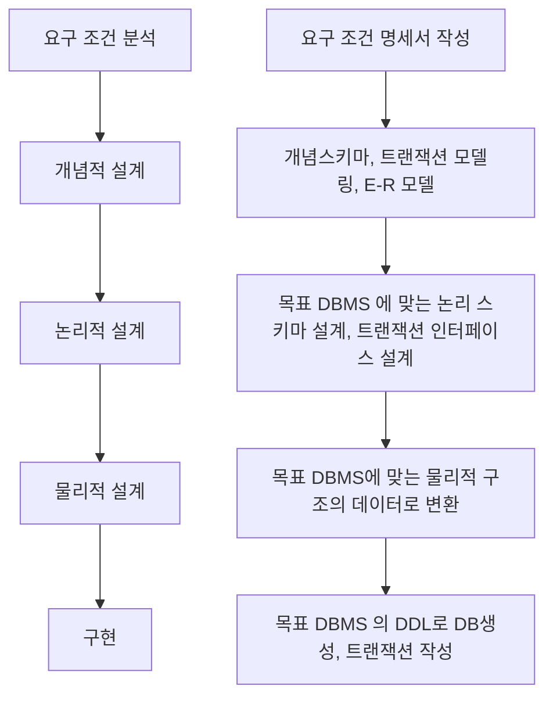

# 001 운영체제의 개념
문제 1. 
운영체제

문제 2. 운영체제의 목적 4가지
1. 스케줄링 제공 
2. 데이터 관리 및 공유
3. 편리한 인터페이스 제공
4. 자원 관리 및 제어

문제 3. 운영체제 운용 기법
1. 다중 프로그래밍 시스템
2. 시분할 시스템
3. 일괄 처리 시스템
4. 다중 처리 시스템


---

# 002 운영체제의 종류

1. Windows 특징
- GUI
- 선점형 멀티태스킹(Preemptive Multi-Tasking)
- PnP (Plug and Play, 자동 감지 기능)
- OLE (Object Linking and Embedding)
- 255자의 긴 파일명
- Single - User 시스템 *유닉스, 리눅스, WindowsNT와 같은 서버용은 Multi - User 시스템

2. UNIX
- 시분할 시스템을 위해 설계된 대화식 운영체제
- 다중사용자(Multi-User), 다중 작업(Multi-Tasking) 지원
- 트리구조 파일 시스템

3. UNIX 시스템 구성
- 커널 : 하드웨어 보호 및 프로그램과 하드웨어 간 인터페이스 역할
- 쉘 : 사용자와 시스템간 인터페이스 담당
- 유틸리티 프로그램 : 사용자가 작성한 응용 프로그램 처리하는 데 사용함, DOS에서의 외부 명령어에 해당됨

4. LINUX
- UNIX 와 완벽하게 호환됨
- 대부분의 특징이 UNIX 와 동일

5. MacOS
- UNIX 기반 개발된 운영체제
- 드라이버 설치 및 삭제 과정이 단순

6. Android
- 리눅스 커널기반 개방형 모바일 운영체제

7. iOS
- 유닉스 기반의 모바일 운영체제

문제1.
1. Android

문제2.
2. UNIX

---

# 003 운영체제 기본 명령어

| 명령어      | 사용법                          | 설명                                                       |
|-------------|---------------------------------|------------------------------------------------------------|
| dir         | `dir`                           | 현재 디렉토리의 파일 및 폴더 목록을 표시합니다.             |
| cd          | `cd [디렉토리 경로]`            | 디렉토리를 변경합니다.                                      |
| copy        | `copy [원본 파일] [대상 파일]`  | 파일을 복사합니다.                                          |
| del         | `del [파일 경로]`               | 파일을 삭제합니다.                                          |
| move        | `move [원본 파일] [대상 경로]`  | 파일을 이동합니다.                                          |
| mkdir       | `mkdir [디렉토리 이름]`         | 새로운 디렉토리를 생성합니다.                               |
| rmdir       | `rmdir [디렉토리 경로]`         | 디렉토리를 삭제합니다. 빈 디렉토리만 삭제할 수 있습니다.     |
| cls         | `cls`                           | 명령 프롬프트 화면을 지웁니다.                              |
| ipconfig    | `ipconfig`                      | 네트워크 설정 정보를 표시합니다.                            |
| ping        | `ping [도메인 또는 IP 주소]`    | 네트워크 연결 상태를 확인합니다.                            |
| tasklist    | `tasklist`                      | 현재 실행 중인 프로세스 목록을 표시합니다.                  |
| taskkill    | `taskkill /PID [프로세스 ID]`   | 특정 프로세스를 종료합니다.                                 |
| systeminfo  | `systeminfo`                    | 시스템의 상세 정보를 표시합니다.                             |
| shutdown    | `shutdown /s /f /t [시간(초)]`  | 시스템을 종료합니다.                                        |
| type        | `type [파일 경로]`              | 파일의 내용을 표시합니다.                                    |
| ren         | `ren [원본 파일명] [새 파일명]` | 파일 이름을 변경합니다.                                      |
| md          | `md [디렉토리 이름]`            | 새로운 디렉토리를 생성합니다. (mkdir과 동일)                  |
| attrib      | `attrib [파일 경로]`            | 파일 또는 디렉토리의 속성을 표시하거나 변경합니다.           |
| chkdsk      | `chkdsk [드라이브:] [옵션]`     | 디스크 상태를 검사하고 오류를 수정합니다.                    |
| format      | `format [드라이브:] [옵션]`     | 디스크를 포맷합니다.                                         |
| move        | `move [원본 파일] [대상 경로]`  | 파일을 이동합니다.                                          |


| 명령어      | 사용법                         | 설명                                                         |
|-------------|--------------------------------|--------------------------------------------------------------|
| ls          | `ls [옵션] [디렉토리]`         | 현재 디렉토리의 파일 및 폴더 목록을 표시합니다.                |
| cd          | `cd [디렉토리 경로]`           | 디렉토리를 변경합니다.                                        |
| cp          | `cp [원본 파일] [대상 파일]`   | 파일을 복사합니다.                                            |
| mv          | `mv [원본 파일] [대상 경로]`   | 파일을 이동하거나 이름을 변경합니다.                           |
| rm          | `rm [파일 경로]`               | 파일을 삭제합니다.                                            |
| mkdir       | `mkdir [디렉토리 이름]`        | 새로운 디렉토리를 생성합니다.                                 |
| rmdir       | `rmdir [디렉토리 경로]`        | 빈 디렉토리를 삭제합니다.                                     |
| touch       | `touch [파일 이름]`            | 새로운 빈 파일을 생성하거나 기존 파일의 수정 시간을 업데이트합니다.|
| cat         | `cat [파일 경로]`              | 파일의 내용을 표시합니다.                                      |
| more        | `more [파일 경로]`             | 파일의 내용을 페이지 단위로 표시합니다.                         |
| less        | `less [파일 경로]`             | `more` 명령어와 유사하지만 더 많은 기능을 제공합니다.            |
| grep        | `grep [패턴] [파일]`           | 파일에서 패턴을 검색합니다.                                    |
| find        | `find [디렉토리] [옵션] [패턴]`| 파일이나 디렉토리를 찾습니다.                                  |
| df          | `df [옵션]`                    | 파일 시스템의 디스크 사용량을 표시합니다.                       |
| du          | `du [옵션] [디렉토리]`         | 파일 및 디렉토리의 디스크 사용량을 표시합니다.                   |
| chmod       | `chmod [모드] [파일]`          | 파일의 접근 권한을 변경합니다.                                  |
| chown       | `chown [소유자] [파일]`        | 파일의 소유자를 변경합니다.                                     |
| ps          | `ps [옵션]`                    | 현재 실행 중인 프로세스를 표시합니다.                           |
| kill        | `kill [옵션] [프로세스 ID]`    | 특정 프로세스를 종료합니다.                                     |
| tar         | `tar [옵션] [파일]`            | 파일을 압축하거나 압축을 풉니다.                                 |
| gzip        | `gzip [파일]`                  | 파일을 압축합니다.                                             |
| gunzip      | `gunzip [파일]`                | 파일 압축을 풉니다.                                             |
| uname       | `uname [옵션]`                 | 시스템 정보를 표시합니다.                                       |
| top         | `top`                          | 실시간 시스템 성능 및 프로세스 정보를 표시합니다.                 |
| whoami      | `whoami`                       | 현재 사용자의 이름을 표시합니다.                                 |
| man         | `man [명령어]`                 | 명령어의 매뉴얼 페이지를 표시합니다.                             |
| echo        | `echo [문자열]`                | 문자열을 출력합니다.                                           |
| ssh         | `ssh [사용자@호스트]`          | 원격 서버에 SSH로 접속합니다.                                   |
| scp         | `scp [원본 파일] [사용자@호스트:대상 경로]` | 파일을 원격 서버로 복사합니다.                                    |
| sudo        | `sudo [명령어]`                | 관리자 권한으로 명령어를 실행합니다.                             |
| apt-get     | `apt-get [옵션] [패키지]`      | 패키지를 관리합니다 (Debian 계열).                               |
| yum         | `yum [옵션] [패키지]`          | 패키지를 관리합니다 (RHEL 계열).                                 |
| service     | `service [서비스] [명령어]`    | 시스템 서비스를 관리합니다.                                     |
| systemctl   | `systemctl [명령어] [서비스]`  | 시스템 및 서비스 관리 도구입니다.                               |


문제

0(예시) : batch.sh 에 소유자와 그룹한테는 전체 권한을 기타 사용자에게는 읽기와 실행 권한만 부여하는 명령문
```shell
chmod 775 batch.sh
```

문제1 : 사용자에게 읽쓰실 : 751

```shell
chmod 751 1.txt
```

문제2 : dir 기능
- 파일및 폴더 목록을 표시한다.

문제3 : 현재 프로세스 표시 및 메모리 사용 현황 
ps

문제4 : 윈도우에서 초기화할때
format

문제5 : UNIX에서 fork 의 기능
몰루

문제6
몰루
chmod  file.txt

문제 7 명령어 제거
chmod o-rw abc.txt

문제 8


문제 9
1. mkdir text1
2. rmdir text2

문제 10
find 가나다 file.txt


---

# 004 스케줄링


---

# 005 데이터베이스 개요

공동으로 사용될 데이터를 중복을 배제하여 통합하고, 저장장치에 저장하여 항상 사용할 수 있도록 운영하는 운영 데이터

DBMS : 사용자의 요구에 따라 정보를 생성, 데이터베이스를 관리해주는 소프트웨어

DBMS 필수기능
- 정의
- 조작
- 제어

스키마
- 데이터 베이스 구조와 제약조건에 관한 전반적인 명세를 기술한 것

스키마 종류
- 외부 스키마 : 논리적 구조를 정의
- 개념 스키마 : 전체적인 논리적 구조, 전체 데이터베이스로 하나만 존재
- 내부 스키마 : 물리적 저장장치에서 본 데이터베이스 구조


문제

문제1

1. 운영 데이터 : c
2. 공유 데이터 : d
3. 저장 데이터 : a
4. 내장 데이터 : b

문제2

1. 외부 스키마
2. 개념 스키마
3. 내부 스키마

문제3. 스키마에 대해 간략 설명
데이터베이스의 `구조`와 `제약 조건`에 대한 전반적인 명세를 기술한 것 

---

# 006. 데이터베이스 설계

데이터베이스설계 : 사요자 요구 분석하여 컴퓨터에 저장가능한 DB의 구조에 맞게 변형 후 DBMS로 데이터베이스를 구현하여 사용자들이 사용할 수 있게 하는 것

데이터베이스 설계시 고려사항
- 무결성
- 일관성
- 회복
- 보안
- 효율성
- 데이터베이스 확장

데이터베이스설계순서



문제

문제1.
요구 분석 - 개념적 설계 - 논리적 설계 - 물리적 설계  - 구현

문제2.
1. 물리적 설계 2. 개념적 설계 3. 논리적 설계

문제3.
- 논리적 설계

# 007. E-R (개체-관계) 모델
- E-R 모델은 개체(entity), 관계(relationship), 속성(attribute)으로 묘사
- e-r 다이어그램으로 표현하며, 1:1, 1:N, N:M 등 관계유현을 제한없이 나타낼 수 있음

정리\image.png

문제1.
- 타원 : 속성
- 이중타원 : 다중값 속성
- 밑줄 타원 : 기본키 속성
- 마름모 : 관계
- 사각형 : 개체 타입

문제2.

1. 개체 : 전화번호, 고개, 주소, id, 현금, isbn, 
2. 관계 : 구매, 책, 

---

# 008. 관계형 데이터베이스의 구조 / 관계 형 데이터 모델

1. 관계형데이터베이스
- 2차원적인 표를 이용해 데이터 상호 관계를 정의하는 데이터베이스
- 코드(E. F. Codd)에 의해 처음 제안.
- 개체, 관계를 모두 릴레이션 이라는 표로 표현.(개체 및 관계 릴레이션 둘다 존재)
장점 : 간결, 보기 편리, 다른 데이터베이스로 변환 용이
단점 : 성능이 떨어짐

1-1. 관계형데이터베이스 구조

이미지

