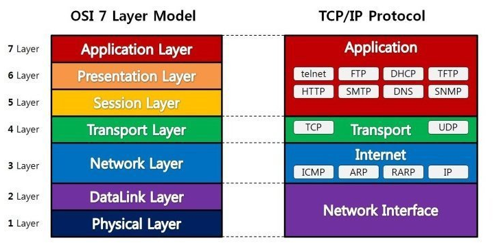

## 01. 운영체제의 개념
운영체제의 목적
- 처리능력 : 일정시간 내에 시스템이 처리하는 양
- 반환시간 : 처리가 완료될 때까지 걸린 시간
- 사용가능도 : 즉시 사용가능한 정도
- 신뢰도 : 주어진 문제를 정확하게 해결하는 정도

운영체제 기능 : 
스케줄링 기능 제공

운영체제 운용 기법
- 일괄 처리 시스템
- 다중 프로그래밍 시스템
- 시분할 시스템
- 다중처리 시스템
- 실시간 처리 시스템
- 다중 모드 처리 : 시분할, 다중처리, 실시간 처리를 한 시스템에서 제공하는 방식
- 분산 처리 시스템

---

문제

### 문제 1: 운영체제의 목적에 대한 설명
운영체제의 목적 중 하나는 '처리능력'입니다. 처리능력을 정의할 때 중요한 기준은 무엇입니까?

A) 시스템이 실행을 중단하는 빈도  
B) 일정 시간 내에 시스템이 처리하는 작업의 양  
C) 사용자가 시스템에 접근하는 속도  
D) 시스템의 에러 발생 빈도

### 문제 2: 운영체제의 기능 관련 질문
운영체제의 주요 기능 중 하나는 '스케줄링'입니다. 스케줄링이 중요한 이유는 무엇입니까?

A) 데이터를 더 빠르게 처리하기 위해  
B) 자원을 효율적으로 관리하고 프로세스 실행 순서를 결정하기 위해  
C) 보안 위험을 최소화하기 위해  
D) 사용자 인터페이스를 개선하기 위해

### 문제 3: 운영체제의 운용 기법에 대한 질문
'다중 모드 처리' 운용 기법에 대한 설명으로 가장 적절하지 않은 것은 무엇입니까?

A) 다중처리 시스템 기법을 포함한다.  
B) 시분할 시스템을 사용하여 효율을 높인다.  
C) 한 시스템에서 한 가지 처리 기법만을 지원한다.  
D) 실시간 처리 기능을 제공할 수 있다.

### 문제 4: 분산 처리 시스템의 이점 설명
분산 처리 시스템의 주요 이점 중 하나는 무엇입니까?

A) 데이터를 한 곳에 집중시켜 관리의 용이성을 제공한다.  
B) 시스템의 부하를 여러 컴퓨터로 분산시켜 전체 시스템의 안정성을 향상시킨다.  
C) 모든 컴퓨팅 자원을 단일 서버에 집중시켜 성능을 최대화한다.  
D) 사용자에게 단일 사용자 시스템의 경험을 제공한다.

1번 B, 2번 B, 3번 C , 4번 B

---

## 02. 프로세스 관리
프로세스 : 프로세서(CPU, 처리기)에 의해 처리되는 실행중인 프로그램을 말함.

- 프로세스는 비동기적 행위를 일으키는 주체이다.

정의 : 여러가지가 있으나 비동기적 행위를 일으키는 주체가 있다.

프로세스의 상태 전이 :

프로세스가 시스템 자원을 어떻게 사용하고 있는지를 나타냄.

### 주요 프로세스 상태

1. **생성 (New)**: 프로세스가 생성되고 초기화되는 단계입니다. 이 상태의 프로세스는 아직 실행을 위한 자원 할당을 받지 않은 상태입니다.

2. **준비 (Ready)**: 프로세스가 CPU에서 실행될 준비가 완료된 상태로, 모든 필요한 자원을 할당받았으나, 아직 CPU를 할당받지 못해 실행 대기 중입니다.

3. **실행 (Running)**: 프로세스가 CPU를 할당받아 명령어들이 실제로 실행되고 있는 상태입니다.

4. **대기 (Blocked or Waiting)**: 프로세스가 특정 이벤트(예: 입출력 완료)가 발생하기를 기다리는 상태입니다. 이 상태의 프로세스는 실행을 계속하기 위해 필요한 조건이 충족될 때까지 CPU를 사용할 수 없습니다.

5. **종료 (Terminated or Exit)**: 프로세스가 실행을 완료하고 시스템에서 제거되는 상태입니다. 이때 프로세스는 사용했던 모든 자원을 반환합니다.

### 프로세스 상태 전이

- **생성 -> 준비**: 프로세스가 시스템에 의해 생성되어 실행을 위한 자원을 할당받으면 준비 상태로 이동합니다.
  
- **준비 -> 실행**: 스케줄러가 프로세스를 선택하여 CPU를 할당하면 실행 상태로 전이됩니다.

- **실행 -> 대기**: 프로세스가 입출력 작업과 같은 이벤트를 기다려야 할 때 대기 상태로 전이됩니다.

- **대기 -> 준비**: 대기 중이던 이벤트가 완료되면, 프로세스는 다시 준비 상태로 돌아가 CPU를 할당받기 위해 준비합니다.

- **실행 -> 준비**: 프로세스가 할당받은 CPU 시간(타임 슬라이스)을 사용하고 더 많은 시간이 필요한 경우, 준비 상태로 다시 돌아가 다음 차례를 기다립니다.

- **실행 -> 종료**: 프로세스가 모든 작업을 완료하고 종료될 때입니다.

스레드 : 
- 프로세스 내의 작업 단위로 시스템의 여러 자원을 할당받아 실행하는 프로그램 단위.
- 자신만의 스택과 레지스터를 갖고 독립된 제어 흐름을 갖는다.
- 프로세스의 일부 특성을 갖고 있어 경량프로세스라고도 한다.

    - 단일 스레드 : 하나의 프로세스가 하나의 스레드가 존재하는 경우
    - 다중 스레드

## 03. 스케줄링 (패스)

스케줄링 : 프로세스가 생성되어 실행될 때 필요한 시스템의 여러 자원을 해당 프로세스에 할당하는 작업을 의미.

스세쿨링 기법
- 비선점 : 할당된 CPU를 다른 프로세스가 빼앗아 사용할 수 없는 스케줄링 기법, FCFS(FIFO), SJF, 우선순위 등의 알고리즘이 있다.
- 선점 : 하나의 프로세스가 CPU를 할당받아 실행하고 있을 때 우선순위가 높은다른 프로세스가 CPU를 강제로 빼앗아 사용할 수 있는 스케줄링 기법, Round Robin, SRT, 선점 우선순위, 다단계 큐 등의 알고리즘이 있다.

### 기법 종류

FCFS(First Come First Service, 선입 선출) = FIFO

SLF(Shortest Job First, 단기 작업 우선) : 실행 시간이 가장 짧은 프로세스에게 먼저 CPU를 할당하는 기법.

HRN(Highest Response-ratio Next) : 실행 시간이 긴 프로세스에 불리한 SLF 기법을 보완하기 위한것. 대기 시간과 서비스(실행) 시간을 이용하는 기법

## 04. 병행 프로세스와 상호 배제 (어려움)
병행 프로세스 : 두 개 이상의 프로세스들이 동시에 존재하여 실행 상태에 있는 것.

임계 구역(Critical Section) : 하나의 프로세스만 자원 또는 데이터를 사용하도록 지정된 공유 자원을 의미.

임계 구역 문제 해결 : 상호 배제, 진행, 한계 대기 3가지 조건을 충족

동기화 기법 : 두 개 이상의 프로세스를 한 시점에서는 동시에 처리할 수 없으므로 각 프로세스에 대한 처리 순서를 결정하는 것으로, 상호 배제의 형태이다.

- 세마 포머 : 
    - 신호기, 깃발을 의미. 각 프로세스에 제어 신호를 전달하여 순서대로 작업을 수행하도록 하는 기법. P
    - P와 V라는 두 개의 연산에 의해 동기화를 유지, 상호 배제 원리 보장.

- 모니터 :
    - 동기화를 구현하기 위한 특수 프로그램 기법.
    - 특정 공유 자원을 프로세스에게 할당하는데 필요한 데이터와 이 데이터를 처리하는 프로시저로 구성된다.
    - 모니터의 경계에서 상호 배제가 시행된다.

교착 상태(Dead Lock) : 
상호 배제에 의해 나타나는 문제점. 무한정 기다리는 현상

교착상태 발생의 필요 충분 조건 :
상호 배제, 점유와 대기, 비선점 환형대기가 충족 되어야 한다.
이 4가지 조건 중 하나라도 충족되지 않으면 교착상태가 발생되지 않는다.

## 05 기억장치 관리 ( PASS)

## 06 디스크 스케줄링 ( PASS)

## 07 정보 관리

파일 시스템 : 파일 저장, 액세스, 공유 보호 등 파일 관리를 총괄하는 기술.

기호화된 이름 : 콘솔(키보드와 모니터가 조합된 장치)은 `CON`, 프린터는 `PRN` 과 같이 표시하는 것을 의미.

파일 디스크립터 : 파일관리를 위한 시스템이 필요로 하는 파일에 대한 정보를 갖고 있는 제어 블록을 의미.

파일 디스크립터 정보
- 파일 이름 및 파일 크기
- 보조기억장치에서의 파일 위치

특징
- 직접 참조 불가
- 해당 파일이 Open 될 때 주 기억장치로 옮겨진다.

파일의 구조 : 보조기억장치에 편성되는 방식을 의미한다.

종류 :
- 순차 파일 (Sequential File) : 논리적인 순서에 따라 기록 SAM이라고도함, 일괄처리
- 직접 파일(Direct File) : 해싱함수를 이용하여 레코드를 저장
- 색인 순차 파일(Indexed Sequential File) : 순차파일과 직접 파일이 결합된 형태. ISAM이라고함. 색인이 가리키는 포인터(주소)를 사용하여 참조 가능.

디렉터리 구조
- 1단계 디렉터리 : 가장 간단. 하나의 디렉터리 내에 위치 관리. 유일한 이름을 가짐
- 2단계 디렉터리 : 중앙에 마스터 디렉터리. 2계층 구조.
- 트리 디렉터리 : 하나의 루트 디렉트리와 서브 디렉터리로 구성된 구조. 유닉스 디렉토리 구조. 디렉터리 탐색은 포인터에 의해 계층적으로 이루어짐
- 비순환 그래프 디렉터리 : 하위 파일이나 하위 디렉터리를 공동으로 사용할 수 있음, 공유 파일 삭제 시 고아 포인터가 발생할 수 있다.
- 일반적인 그래프 디렉터리 : 트리 구조에 링크를 첨가해 순환을 허용하는 그래프 구조. 참조 계수기가 필요

자원보호 :
사용자, 프로세스 등 의 주체가 불법적접근을 제어하고 자원(객체)의 물리적인 손상을 예방하는 기법을 의미한다.

종류 : 
- 접근 제어 행렬 (Access Control Matrix) : 접근 권한을 행렬로 표기한 기법
- 전역 테이블 (Global Table) : 가장 단순한 구현방법 , 접근 권환의 집합을 목록 형태로 구성. 주기억장치에 저장시 공간 낭비됨. 
- 접근 제어 리스트(Access Control List) : 객체를 중심으로 접근 리스트를 구성한 것. 
- 권한(자격)리스트 : 행, 중심으로 권한 리스트를 구성한것

## 08 분산 운영체제

분산처리 시스템 목적
- 자원 공유 
- 연산 속도 향상
- 신뢰도 향상
- 컴퓨터 통신

## 09 운영체제의 실제

1. UNIX의 개요 및 특징

UNIX
- 시분할 시스템을 위해 설계된 대화식 운영체제.

## 10 정보 통신 기본

- 모뎀 : 디지털 데이터를 아날로그 신호로 변환 하는 변조 기능, 아날로그 신호를 디지털 데이터로 변환하는 복조 기능이 있다.

- DSU(Digital Service Unit) : 디지털 데이터를 디지털 회선을 통해 전송하기 위해 디지털 신호로 변환한다.

- RS-232C : 25핀

## 011 정보 전송 기술

광성유 케이블
- 코어 : 빛 전파 영역, 굴절율 높음
- 클래스 : 코어보다 굴절율 낮음. 빛 외부로 못빠져나가게 함, 외부 압력보호
- 재킷 : 내부 보호

변조 속도 = baud = 1/ T  , T는 초

데이터 신호 속도(bps) =변조 속도(baud) * 변조 시 상태 변화 수

통신 용량

통신 용량 늘리는 법
- 대역폭 높임
- 신호 세력을 높임
- 잡음 세력을 줄임

PCM 방식 변조 순서
- 신호 -> 표본화 -> 양자화 -> 부호화

## 012 전송방식 / 전송 제어

- 단방향 : 라디오, TV
- 반이중 : 무전기 , 모뎀
- 전이중 : 4선식 선로, 분할시 2선식 가능, 전화, 전용선

동기식 / 비동기식
- 동기식 : 문자열을 블록(프레임)으로 만들어 일시에 전송하는 방식
    - 특징 
    1. 휴지 시간(Idle Time) 없다
    2. 전송속도 빠름
    3. 효율 좋다
    4. 원거리 전송
    5. 버퍼 기억 장치 내장 필요함

- 비동기식 : 부호(문자 코드) 앞뒤에 시작 비트, 정지비트를 붙여 바이트구별하여 전송하는 방식
    - 특징
    1. 오류 검출을 위한 패리티 비트 추가할 수있음
    2. 휴지 시간이 불규칙적임
    3. 프레이밍 에러(많은 데이터 보낼 시 오류) 가능성있다
    4. 저속, 단거리 전송용
    5. 동기화 단순, 가격 저렴
    6. 전송 효율이 떨어짐

오류 발생 원인
- 감쇄 : 거리에 따라 약해지는 현상
- 지연 왜곡 : 속도가 달라서 생기는 오류
- 백색 잡음 : 온도에 따라 전자의 운동량으로 생기는 잡음. 가우스 잡음. 열 잡음이라고도 함
- 상호 변조 잡음 : 서로 다른 주파수들이 하나의 매체를 공유할 때 주파수 간섭 등의 잡음
- 누화 잡음 = 혼선 : 인접한 매체들의 전자기적 상호 유도 작용에 의해 생기는 잡음
- 충격성 잡음 : 번개와 같은 외부 충격 시스템 결함, 파손 등 기계적인 충격에 의한 잡음

자동 반복 요청
- ARQ : 오류 발생시 수신측 : 송신측에 알림, 송신측 : 재전송 하는 모든 절차를 의미

오류 검출 방식
- 패리티 검사 : 1비트 검사비트에 패리티 비트를 추가하여 오류 검출. 간단함. 2개비트 동시 오류시 검출 불가. 검출만 가능
- 해밍 코드 : 수신측에서 오류 직접 수정하는 방식, 잉여 비트가 많이 필요, 2n번째 를 패리티 비트로 사용
- 순환 중복 검사(CRC) : 프레임 단위로 오류 검출 을 위한 다항식 코드 FCS를 사용하여 오류 검출

## 013 통신 프로토콜

X.25 : DTE와 DCE 간의 인터페이스를 제공하는 프로토콜.
- 강력 한 오류 체크 기능으로 신뢰성 높다.
- 우수한 호환성
- 경로 우회전송 가능
- 전송 품질 우수

X.25 계층 구조 : 물리 계층, 프레임 계층, 패킷 계층

TCP/IP : 컴퓨터 간에 데이터를 주고 받을 수 있도록 하는 표준 프로토콜

- TCP : 전송계층. 연결형 서비스, 오류제어, 흐름 제어
- IP : 네트워크 계층. 비연결형 서비스, 패킷 분해,

## 14 OSI 7 계층
OSI 7 계층 모델은 네트워크 통신을 위한 표준 아키텍처로, 통신 과정을 일곱 개의 추상적인 계층으로 나누어 각 계층에서 수행해야 할 기능을 정의

## OSI 7 계층 모델
Q. UDP, TCP 라는 단어가 나온다 
A. 전송계층 (Transport Layer)

Q. 네트워크 관련 단어가 나온다
A. 네트워크 계층 (Network Layer)

Q. 라우터, IP 관련 단어가 나온다
A. 네트워크 계층

### OSI 7 계층 모델

1. **물리 계층 (Physical Layer)**
   - 역할: 실제적인 전기적 신호를 전달하는 계층입니다. 데이터를 전기 신호로 변환하여 네트워크를 통해 송수신합니다.
   - 예: 케이블, RJ45, 광섬유 등

2. **데이터 링크 계층 (Data Link Layer)**
   - 역할: 통신의 오류를 발견하고 수정하는 기능을 담당합니다. 물리 계층을 통해 송수신되는 정보의 오류와 흐름을 관리합니다.
   - 예: 이더넷, PPP, 스위치, MAC 주소 등

3. **네트워크 계층 (Network Layer)**
   - 역할: 다른 네트워크와의 경로를 설정하고, 데이터 패킷을 송신지에서 수신지까지 전달하는 기능을 담당합니다. IP 주소를 활용하여 경로를 선택합니다.
   - 예: 라우터, IP 주소 등

4. **전송 계층 (Transport Layer)**
   - 역할: 데이터의 전송을 관리합니다. 통신을 활성화하기 위한 포트를 관리하며, 전송 오류 검출 및 복구, 흐름 제어 등을 수행합니다.
   - 예: TCP, UDP, 포트 번호 등

5. **세션 계층 (Session Layer)**
   - 역할: 양 끝단의 응용 프로세스가 통신을 관리하기 위한 방법을 제공합니다. 세션 설정, 유지, 종료 등을 담당합니다.
   - 예: API, 소켓 등

6. **표현 계층 (Presentation Layer)**
   - 역할: 데이터 표현에 대한 독립성을 제공하고, 암호화하는 계층입니다. 데이터를 애플리케이션에서 사용할 수 있는 형태로 변환하거나, 애플리케이션 형식을 네트워크 형식으로 변환합니다.
   - 예: 문자 인코딩, 데이터 압축, 암호화 등

7. **응용 계층 (Application Layer)**
   - 역할: 네트워크 소프트웨어 UI와 같은 응용 프로그램을 네트워크에 연결합니다. 최종 사용자의 인터페이스를 담당하며, 데이터 입/출력 및 관리 등의 기능을 수행합니다.
   - 예: HTTP, FTP, 웹 브라우저, 이메일 등

---

| 계층 번호 | 계층 이름             | 역할                                                         | 예시                                  |
|-----------|-----------------------|--------------------------------------------------------------|---------------------------------------|
| 1         | 물리 계층 (Physical)  | 데이터를 전기 신호로 변환하여 네트워크를 통해 송수신합니다.   | 케이블, RJ45, 광섬유                  |
| 2         | 데이터 링크 (Data Link)| 오류 검출 및 수정, 흐름 및 순서 제어를 담당합니다.           | 이더넷, PPP, 스위치, MAC 주소         |
| 3         | 네트워크 (Network)     | 데이터 패킷의 경로 설정 및 전송을 담당합니다.                 | 라우터, IP 주소                       |
| 4         | 전송 (Transport)       | 데이터 전송의 신뢰성을 보장하며, 오류 검출 및 복구를 수행합니다. | TCP, UDP, 포트 번호                  |
| 5         | 세션 (Session)         | 양 끝단의 응용 프로그램 간 통신 세션을 관리합니다.            | API, 소켓                            |
| 6         | 표현 (Presentation)    | 데이터 형식 변환, 암호화 등을 통해 통신을 가능하게 합니다.    | 문자 인코딩, 데이터 압축, 암호화     |
| 7         | 응용 (Application)     | 최종 사용자와 가장 가까운 계층으로, 응용 프로그램을 네트워크에 연결합니다. | HTTP, FTP, 웹 브라우저, 이메일       |

---

## 015 경로 제어 프로토콜 pass

경로 제어 프로토콜(Rounting Protocol) : 네트워크 정보를 생성, 교환, 제어 하는 프로토콜

종류 : IGP, EGP, BGP

## 016 정보 통신망 기술

회선 교환 방식 : 접속에 긴 시간 소요. 전송 지연이 없음 실시간 전송 가능
- 통신 과정 : 호(링크)설정 -> 데이터 전송 -> 호(링크) 해제

패킷 교환 방식 : 메시지를 일정길이의 패킷으로 잘라서 전송하는 방식

특징 
- 빠르다
- 디지털 전송에 적합
- 코드 및 속도 변환 가능
- X.75 프로토콜
- 대량 데이터 전송 시 전송 지연이 많음
- 대역폭 유동적

LAN : 물리 계층, 데이터 링크 계층

| 장비     | 기능                                                         | OSI 계층 | 특징                                                              |
|----------|--------------------------------------------------------------|----------|------------------------------------------------------------------|
| 허브     | 여러 장치들을 연결하여 데이터를 전송                         | 물리 계층 | 데이터가 연결된 모든 포트로 전송됨.                               |
| 리피터   | 신호를 증폭하여 더 먼 거리로 전달                           | 물리 계층 | 신호 감쇠를 방지하여 거리 확장.                                    |
| 브리지   | 두 네트워크를 연결하고 데이터 필터링                        | 데이터 링크 계층 | MAC 주소 기반 데이터 필터링.                                      |
| 라우터   | 서로 다른 네트워크 간의 데이터 경로를 결정하여 전송          | 네트워크 계층 | IP 주소 기반 데이터 전송. 다양한 네트워크 연결 지원.               |
| 게이트웨이| 네트워크 프로토콜 변환 및 서로 다른 네트워크 간의 통신       | 여러 계층  | 서로 다른 네트워크 아키텍처 간의 통신 가능.                        |

IP 주소 : 8비트씩 4분분, 총 32비트

A클래스 255.0.0.0
B클래스 255.255.0.0
C클래스 255.255.255.0

IPv6 주소 : 16비트 씩 8부분, 총 128비트로 구성
ㄴ 주소 체계 : 유니캐스트, 멀티캐스트, 애니캐스트

## 020 XP(eXtreme Programming) 기법

XP는 고객의 요구사항에 유연하게 대응하기 위해 고객의 참여와 개발과정의 반복을 극대화 하여 개발 생산성을 향상하는 방법

XP는 `애자일 개발 방법론`을 기잔으로 한 SW개발 모형이다.

특징 : 고객의 적극적인 참여를 통해 빠르게 개발하는 것을 목적으로 함

XP 5가지 핵심 가치 : 의사소통, 단순성, 용기, 존중, 피드백

사용자 스토리 -> 계획 수립 -> 스파이크 -> 이터레이션
 -> 승인 검사 -> 소규모 릴리즈

 XP 주요 실천 방법
 - Pair 프로그래밍 : 다른사람과 함께 프로그래밍 수행

- Collective OwenerShip(공동 코드 소유) : 개발코드 권한과 책임을 공동 소유

- Test-Driven Development : 테스트 주도 개발

- While Team (전체팀) : 개발 참여하는 모든 구성원 모두 각자 역할에 대한 책임을 가짐

- Design Improvement(디자인 개선) 또는 Refactoring(리팩토링) : 프로그램 기능 변경 없이, 단순화, 유연성 강화 등을 통해 시스템을 재구성.

## 021 요구사항 정의

요구사항 프로세스 순서
1. 도출
2. 분석
3. 명세
4. 확인
